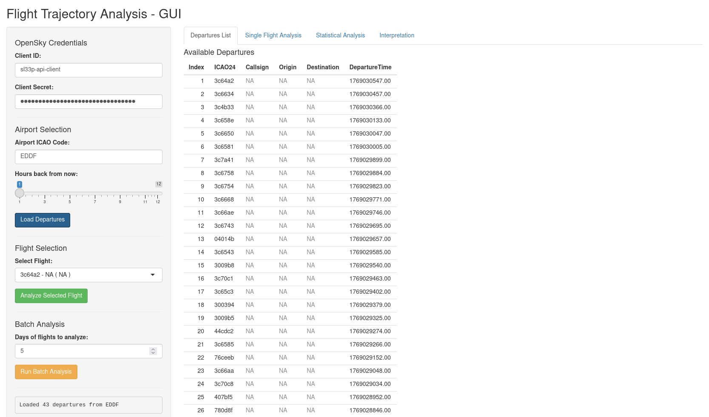
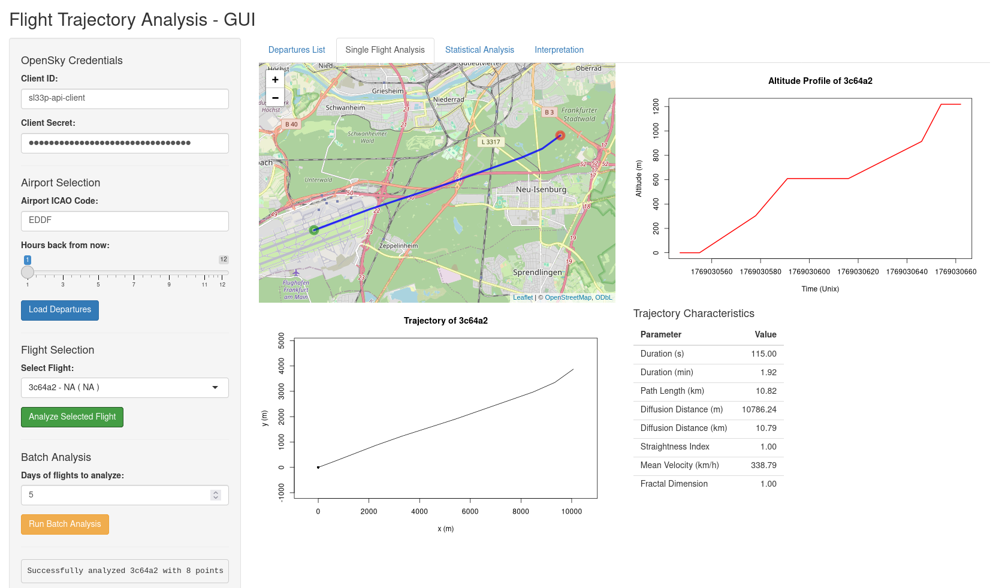
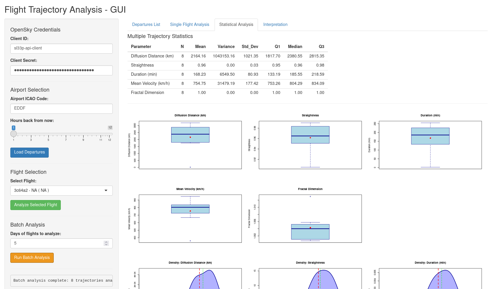
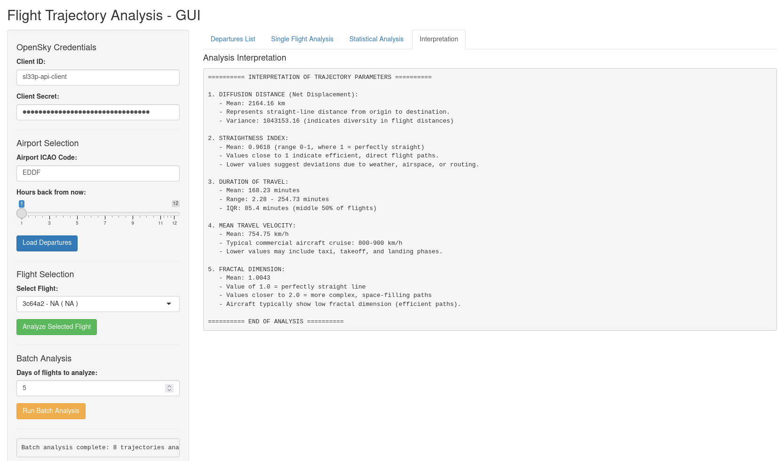

# TOPIC 8

Develop an R-based software, which will perform the following tasks:

1.  download from the OpenSky Network online database the observations of the trajectory of a randomly selected aircraft on a randomly selected flight over at least five days, in uninterrupted continuity (1)

2.  perform the selections in the graphical user interface (GUI) of your R script,

3.  determine the characteristics of each trajectory according to the parameters: diffusion distance, straightness, duration of travel, mean travel velocity and fractal dimension (2),

4.  using the R library trajr, (4) perform basic statistical analysis of the parameters of daily trajectories from (3): arithmetic mean, variance, quartiles, boxplot, estimate of the density function of the experimental statistical distribution, analyze and interpret them.

5.  Demonstrate the application of the developed software support on a selected example of use.

6.  In the final project report, describe the problem, describe the method and the developed software support in the R environment, present and interpret the results, and form a conclusion.

## Demo





## Resources

1.  [The OpenSky Network. (2025). Internet archive of observed aircraft trajectories.](https://opensky-network.org/datasets/states/)
2.  [Schäfer, M, Strohmeier, M, Lenders, V, Martinovic, I, Wilhelm, M. (2014). Bringing Up OpenSky: A Large-scale ADS-B Sensor Network for Research. In Proceedings of the 13th IEEE/ACM International Symposium on Information Processing in Sensor Networks (IPSN), pages 83-94.](https://opensky-network.org/files/publications/ipsn2014.pdf)
3.  [Zheng, Y. (2015). Trajectory Data Mining: An Overview. ACM Transactions on Intelligent Systems and Technology, 61(3), 1–41.](https://doi.org/10.1145/2743025)
4.  [Thulin, M. (2025). Modern Statistics with R: From wrangling and exploring data to inference and predictive modelling. CRC Press. Boca Raton, Fl.](https://modernstatisticswithr.com/)
5.  [McLean, D J, and Skowron Volponi, M A. (2018). trajr: An R package for characterisation of animal trajectories. Ethology, 124, 440–448.](https://doi.org/10.1111/eth.12739)

## Setup

Use [renv](https://rstudio.github.io/renv/articles/renv.html) to install the correct dependencies using

``` r
renv::restore()
```

[OpenSky](https://opensky-network.org) access also requires credentials placed in a `.env` file, for which an example is provided in `.env.example`.
